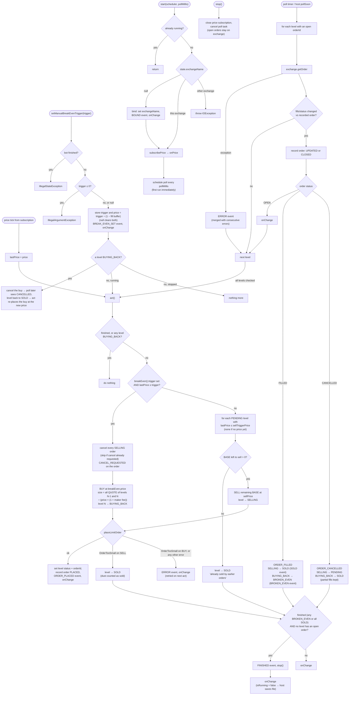

# Flow

```mermaid
flowchart TD
    %% ---------- Entry points ----------
    START(["start(scheduler, pollMillis)"])
    PRICE(["price tick from subscription"])
    TIMER(["poll timer / host pollSoon"])
    MANUAL(["setManualBreakEvenTrigger(trigger)"])
    STOP(["stop()"])

    %% ---------- start ----------
    START --> S0{"already running?"}
    S0 -->|yes| S_RET["return"]
    S0 -->|no| S1{"state.exchangeName"}
    S1 -->|null| S2["bind: set exchangeName,<br/>BOUND event, onChange"]
    S1 -->|this exchange| S3
    S1 -->|other exchange| S_ERR["throw IOException"]
    S2 --> S3["subscribePrice → onPrice"]
    S3 --> S4["schedule poll every pollMillis<br/>(first run immediately)"]

    %% ---------- stop ----------
    STOP --> X1["close price subscription,<br/>cancel poll task<br/>(open orders stay on exchange)"]

    %% ---------- onPrice ----------
    PRICE --> OP["lastPrice = price"] --> ACT

    %% ---------- poll / track ----------
    TIMER --> P0["for each level with an open orderId"]
    P0 --> P1["exchange.getOrder"]
    P1 -->|exception| P_ERR["ERROR event<br/>(merged with consecutive errors)"] --> P_NEXT
    P1 --> T0{"fills/status changed<br/>vs recorded order?"}
    T0 -->|no| P_NEXT
    T0 -->|yes| T1["record order: UPDATED or CLOSED"]
    T1 --> T2{"order status"}
    T2 -->|OPEN| T3["onChange"] --> P_NEXT
    T2 -->|FILLED| T4["ORDER_FILLED<br/>SELLING → SOLD (SOLD event)<br/>BUYING_BACK → BROKEN_EVEN (BROKEN_EVEN event)"]
    T2 -->|CANCELLED| T5["ORDER_CANCELLED<br/>SELLING → PENDING<br/>BUYING_BACK → SOLD<br/>(partial fills kept)"]
    T4 --> FIN
    T5 --> FIN
    P_NEXT["next level"] -->|all levels checked| ACT

    %% ---------- act ----------
    ACT["act()"] --> A0{"finished, or any level<br/>BUYING_BACK?"}
    A0 -->|yes| A_RET["do nothing"]
    A0 -->|no| A1{"breakEven().trigger set<br/>AND lastPrice ≥ trigger?"}
    A1 -->|yes| A2["cancel every SELLING order<br/>(skip if cancel already requested)<br/>CANCEL_REQUESTED on the order"]
    A2 --> A3["BUY at breakEven.price<br/>size = all QUOTE of levels N-1 and N<br/>÷ (price × (1 + maker fee))<br/>level N → BUYING_BACK"]
    A3 --> PL
    A1 -->|no| A4["for each PENDING level with<br/>lastPrice ≤ sellTriggerPrice<br/>(none if no price yet)"]
    A4 --> A5{"BASE left to sell > 0?"}
    A5 -->|no| A6["level → SOLD<br/>'already sold by earlier orders'"] --> FIN
    A5 -->|yes| A7["SELL remaining BASE at sellPrice<br/>level → SELLING"] --> PL

    %% ---------- place ----------
    PL{"placeLimitOrder"}
    PL -->|ok| PL1["set level status + orderId,<br/>record order PLACED,<br/>ORDER_PLACED event, onChange"]
    PL -->|OrderTooSmall on SELL| PL2["level → SOLD<br/>(dust counted as sold)"] --> FIN
    PL -->|"OrderTooSmall on BUY, or any other error"| PL3["ERROR event, onChange<br/>(retried on next act)"]

    %% ---------- finish ----------
    FIN{"finished (any BROKEN_EVEN or all SOLD)<br/>AND no level has an open order?"}
    FIN -->|yes| F1["FINISHED event, stop()"] --> F2["onChange<br/>(isRunning = false → host saves file)"]
    FIN -->|no| F3["onChange"]

    %% ---------- manual break-even ----------
    MANUAL --> M0{"bot finished?"}
    M0 -->|yes| M_E1["IllegalStateException"]
    M0 -->|no| M1{"trigger ≤ 0?"}
    M1 -->|yes| M_E2["IllegalArgumentException"]
    M1 -->|"no, or null"| M2["store trigger and price = trigger ÷ (1 − fill buffer)<br/>(null clears both)<br/>BREAK_EVEN_SET event, onChange"]
    M2 --> M3{"a level BUYING_BACK?"}
    M3 -->|yes| M4["cancel the buy → poll later sees CANCELLED,<br/>level back to SOLD → act re-places the buy at the new price"]
    M3 -->|"no, running"| ACT
    M3 -->|"no, stopped"| M_RET["nothing more"]
```
