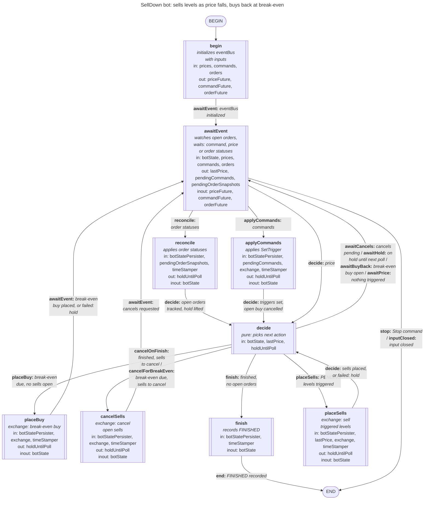

```mermaid
---
title: "SellDown bot: sells levels as price falls, buys back at break-even"
---
flowchart
BEGIN([BEGIN])
END([END])
reconcile[["<b>reconcile</b><br/><i>applies order statuses</i><br/>in: botStatePersister, pendingOrderSnapshots, timeStamper<br/>out: holdUntilPoll<br/>inout: botState"]]
reconcile -->|"<b>decide:</b> <i>open orders</i><br/><i>tracked, hold lifted</i>"| decide
placeBuy[["<b>placeBuy</b><br/><i>exchange: break-even buy</i><br/>in: botStatePersister, exchange, timeStamper<br/>out: holdUntilPoll<br/>inout: botState"]]
placeBuy -->|"<b>awaitEvent:</b> <i>break-even</i><br/><i>buy placed, or failed:</i><br/><i>hold</i>"| awaitEvent
cancelSells[["<b>cancelSells</b><br/><i>exchange: cancel<br/>open sells</i><br/>in: botStatePersister, exchange, timeStamper<br/>out: holdUntilPoll<br/>inout: botState"]]
cancelSells -->|"<b>awaitEvent:</b><br/><i>cancels requested</i>"| awaitEvent
applyCommands[["<b>applyCommands</b><br/><i>applies SetTrigger</i><br/>in: botStatePersister, pendingCommands, exchange, timeStamper<br/>out: holdUntilPoll<br/>inout: botState"]]
applyCommands -->|"<b>decide:</b> <i>triggers set,</i><br/><i>open buy cancelled</i>"| decide
finish[["<b>finish</b><br/><i>records FINISHED</i><br/>in: botStatePersister, timeStamper<br/>inout: botState"]]
finish -->|"<b>end:</b> <i>FINISHED recorded</i>"| END([END])
decide[["<b>decide</b><br/><i>pure: picks next action</i><br/>in: botState, lastPrice, holdUntilPoll"]]
decide -->|"<b>finish:</b> <i>finished,</i><br/><i>no open orders</i>"| finish
decide -->|"<b>cancelOnFinish:</b><br/><i>finished, sells</i><br/><i>to cancel</i> /<br/><b>cancelForBreakEven:</b><br/><i>break-even due,</i><br/><i>sells to cancel</i>"| cancelSells
decide -->|"<b>placeBuy:</b> <i>break-even</i><br/><i>due, no sells open</i>"| placeBuy
decide -->|"<b>placeSells:</b> <i>PENDING</i><br/><i>levels triggered</i>"| placeSells
decide -->|"<b>awaitCancels:</b> <i>cancels</i><br/><i>pending</i> / <b>awaitHold:</b> <i>on</i><br/><i>hold until next poll</i> /<br/><b>awaitBuyBack:</b> <i>break-even</i><br/><i>buy open</i> / <b>awaitPrice:</b><br/><i>nothing triggered</i>"| awaitEvent
begin[["<b>begin</b><br/><i>initializes eventBus<br/>with inputs</i><br/>in: prices, commands, orders<br/>out: priceFuture, commandFuture, orderFuture"]]
BEGIN([BEGIN]) --> begin
begin -->|"<b>awaitEvent:</b> <i>eventBus</i><br/><i>initialized</i>"| awaitEvent
awaitEvent[["<b>awaitEvent</b><br/><i>watches open orders,<br/>waits: command, price<br/>or order statuses</i><br/>in: botState, prices, commands, orders<br/>out: lastPrice, pendingCommands, pendingOrderSnapshots<br/>inout: priceFuture, commandFuture, orderFuture"]]
awaitEvent -->|"<b>applyCommands:</b> <i>commands</i>"| applyCommands
awaitEvent -->|"<b>decide:</b> <i>price</i>"| decide
awaitEvent -->|"<b>reconcile:</b><br/><i>order statuses</i>"| reconcile
awaitEvent -->|"<b>stop:</b> <i>Stop command</i><br/>/ <b>inputClosed:</b><br/><i>input closed</i>"| END([END])
placeSells[["<b>placeSells</b><br/><i>exchange: sell<br/>triggered levels</i><br/>in: botStatePersister, lastPrice, exchange, timeStamper<br/>out: holdUntilPoll<br/>inout: botState"]]
placeSells -->|"<b>decide:</b> <i>sells placed,</i><br/><i>or failed: hold</i>"| decide
```